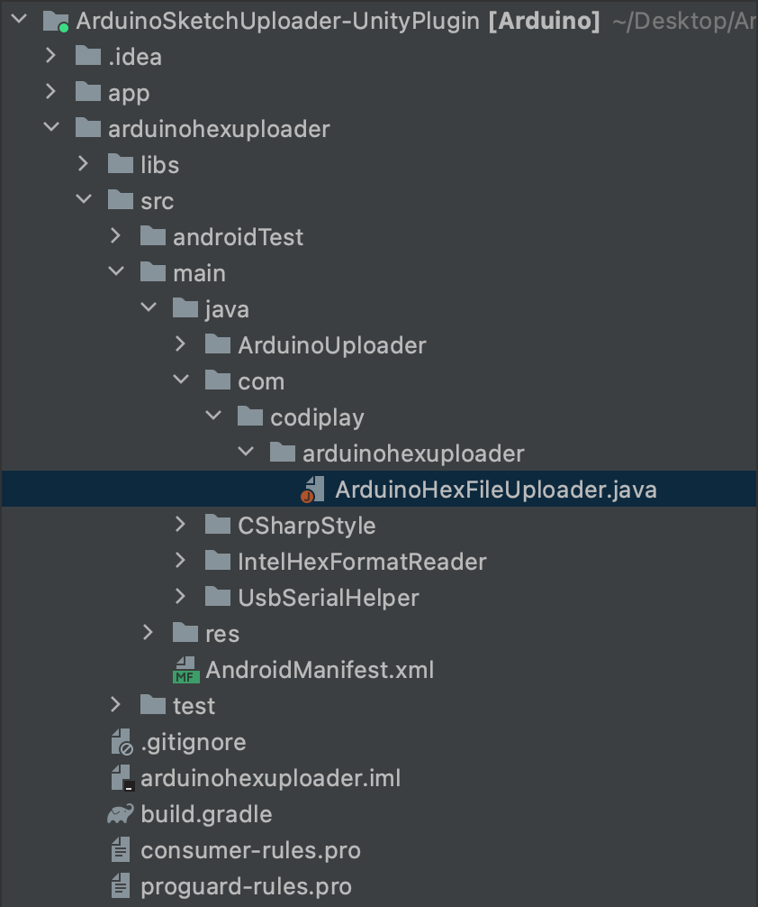

# ArduinoSketchUploader-UnityPlugin

This project is an Android plugin that implements the function of uploading binary files compiled in Unity to the Arduino development board through USB port serial communication.

## Installation and Open project

---

After installing this project, open it in AndroidStudio.

## Getting started

---

In this project, modify the `Arduino HexFileUploader.java` file in the path below.


## Developing

---

### Send message to Unity

Using this plugin, you can send messages needed to Unity in string form. The `UnityCall_Message` function is a function that can be called within this file.

```
public void UnityCall_Message(String message) {
        UnityPlayer.UnitySendMessage("ArduinoSketchUploader", "JavaAnswer_Message", message);
    }
```

The `UnityPlayer.UnitySendMessage` function is for sending a string to Unity. It cannot be modified.

The first param `ArduinoSketchUploader` is the name of Unity’s game object. Find the name of the game object that exists in the Unity scene through the plugin. In order to send messages through this plugin, there must be a game object named `ArduinoSketchUploader` in the scene. You can change this, but you'll also need to change the game object name in your game scene in Unity.

The second parameter, `JavaAnswer_Message` is the function name of the C# script added to the Unity game object. If it accesses a Unity game object through the first parameter, look for a function with the same name as the second parameter in the script added to the game object. If a function with the same name is found, it calls that function.

When executing a Unity function, the third parameter, `message` the message string, is passed as a parameter.

### Call function from Unity

If you call the function below in Unity connected to this Android plugin, the function below will be executed.
The `UnityAnswer_UploadArduinoHex` function takes two parameters: `type` and `path`.

`type` is the index of the Arduino board type, and `path` represents the local path of the compiled binary file.

```
public void UnityAnswer_UploadArduinoHex(int type, String path) {
    usbManager = (UsbManager) UnityPlayer.currentActivity.getSystemService(Context.USB_SERVICE);
    usbDevice = null;

    HashMap<String, UsbDevice> deviceList = usbManager.getDeviceList();
    Iterator<UsbDevice> deviceIterator = deviceList.values().iterator();
    while (deviceIterator.hasNext()) {
        usbDevice = deviceIterator.next();
        break;
    }

    if (usbDevice == null) {
        // no connected usbDevice
        UnityCall_Message("error_USB not connected");
    } else {
        // there is a connected usbDevice
        boardType = type;
        filePath = path;

        IntentFilter filter = new IntentFilter(ACTION_USB_PERMISSION);
        UnityPlayer.currentActivity.registerReceiver(mUsbHardwareReceiver, filter);
        PendingIntent permissionIntent = PendingIntent.getBroadcast(UnityPlayer.currentActivity, 0, new Intent(ACTION_USB_PERMISSION), 0);
        usbManager.requestPermission(usbDevice, permissionIntent);
    }
}
```

Read device information connected to the USB port using the code below.

```
usbManager = (UsbManager) UnityPlayer.currentActivity.getSystemService(Context.USB_SERVICE);
usbDevice = null;

HashMap<String, UsbDevice> deviceList = usbManager.getDeviceList();
Iterator<UsbDevice> deviceIterator = deviceList.values().iterator();
while (deviceIterator.hasNext()) {
    usbDevice = deviceIterator.next();
    break;
}
```

if `usbDevice == null`, it indicates that there is no device connected to the USB port.

```
IntentFilter filter = new IntentFilter(ACTION_USB_PERMISSION);
UnityPlayer.currentActivity.registerReceiver(mUsbHardwareReceiver, filter);
PendingIntent permissionIntent = PendingIntent.getBroadcast(UnityPlayer.currentActivity, 0, new Intent(ACTION_USB_PERMISSION), 0);
usbManager.requestPermission(usbDevice, permissionIntent);
```

If there is a device connected to the USB port, it requests USB access permission from Android.

We will receive feedback on USB port access permissions from the broadcast receiver below. If the user refuses USB access permission, the user is notified that the permission has been denied. If the user grants USB access permission, the `Upload()` function is called.

```
private final BroadcastReceiver mUsbHardwareReceiver = new BroadcastReceiver() {
    @Override
    public void onReceive(Context context, Intent intent) {
        String action = intent.getAction();

        if (action.equals(ACTION_USB_PERMISSION)) {
            if (intent.getBooleanExtra(UsbManager.EXTRA_PERMISSION_GRANTED, false)) {
                // User accepted our USB connection. Try to open the device as a serial port
                UsbDevice grantedDevice = intent.getExtras().getParcelable(UsbManager.EXTRA_DEVICE);

                if (grantedDevice != null) {
                    Upload();
                    UnityPlayer.currentActivity.unregisterReceiver(mUsbHardwareReceiver);
                }
            } else {
                // User not accepted our USB connection. Send an Intent to the Main Activity
                UnityCall_Message("error_USB Permission denied");
                UnityPlayer.currentActivity.unregisterReceiver(mUsbHardwareReceiver);
            }
        }
    }
};
```

### Uploading binary to Arduino

When the `Upload()` function is called, upload options are set according to the Arduino board type index. Then, call the `uploader.UploadSketch()` function to upload the binary file to the Arduino board.

```
private IProgress<Double> progress = new IProgress<Double>() {
    @Override
    public void Report(Double value) {
        UnityCall_Message("uploading progress... " + Math.round(value*100) + "%");
    }
};
```

Using the above function, the upload progress of the binary is converted into % and calculated.

```
private IArduinoUploaderLogger logger = new IArduinoUploaderLogger() {

    @Override
    public void Error(String message, Exception exception) {
        UnityCall_Message("error_" + message);
    }

    @Override
    public void Warn(String message) {
//      UnityCall_Message("Warn:" + message);
    }

    @Override
    public void Info(String message) {
//      UnityCall_Message("Info:" + message);
        if (message.startsWith("All done")) {
            UnityCall_Message("success");
        }
    }

    @Override
    public void Debug(String message) {
//      UnityCall_Message("Debug:" + message);
    }

    @Override
    public void Trace(String message) {
//      UnityCall_Message("Trace:" + message);
    }
};
```

Through the above function, logs are received when the binary upload is in progress.
If the upload of the binary file is completed, you will receive an `“All done”` log from the `Info` function.

## Build

---

To build and export the completed plugin, select `Build/Make Module '~'`.
Use the completed plugin module by placing it in the `Plugin` folder of your Unity project.
